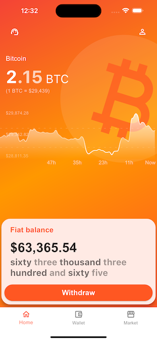

## What is this?

This is an example application to present an approach to build Flutter codebase. 

## What is inside?

- [x] /lib/lib - Pure dart code, platform agnostic. 
- [x] /lib/ui - Everything ui related. Screens, widgets, BLOCs.
- [x] /test - Tests structured in the same way as /lib. You can find example tests for BLOCs, widgets and pure dart code. The project doesn't have 100% code coverage as it is an example only.

## How to build?

- Just run it. The project relies on build_runner but in this case generated files are included in repository for convenience.
